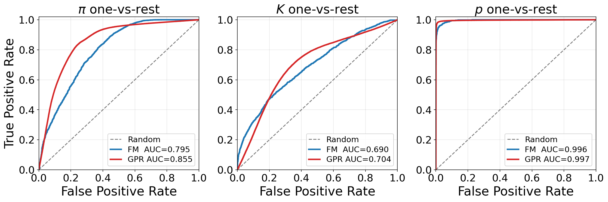

# FM vs. GPR — apple-to-apple PID capability comparison

One figure, three panels (π / K / p), each overlaying the **one-vs-rest ROC
curve** of two PID methods in a single momentum bin (default **0.8–1.2 GeV/c**):

- **GPR** — traditional dE/dx band fitting (`dedx_analysis`, Gaussian Process
  Regression of dE/dx vs. momentum), the deployed *with-prior* configuration.
- **FM** — Shuhang's foundation model, per-point PID probabilities aggregated to
  track level.

Output (one set per momentum bin): `pid_roc_comparison_<lo>_<hi>.{png,pdf}` and
`auc_summary_<lo>_<hi>.csv`. Generated bins: **0.8–1.2**, **0.0–1.0**, **1.0–2.0** GeV/c.



> **GPR is always fit over 0.5–2.0 GeV/c** (one band set, reused for every bin).
> In the **0.0–1.0** bin most tracks sit below 0.5 GeV/c, where the GPR band is
> *extrapolated* — its AUC there reflects out-of-fit-range behavior, not low-p
> dE/dx capability. The 1.0–2.0 bin is fully inside the fit range.

## Result (p ∈ [0.8, 1.2) GeV/c, 1M ROOT / FM eval set)

| Species | GPR AUC | FM AUC | N_sig (GPR / FM) |
|---|---|---|---|
| π (211)  | **0.855** | 0.795 | 401 646 / 9 033 |
| K (321)  | **0.704** | 0.690 | 52 923 / 1 181 |
| p (2212) | 0.997 | 0.996 | 86 242 / 586 |

- **Proton**: both methods essentially saturate (dE/dx is very well separated here).
- **Kaon**: hardest case for both; curves cross — FM is slightly better at low FPR,
  GPR at high FPR; AUCs within ~0.01.
- **Pion**: GPR leads over FM across most of the curve in this bin.

N_sig differs because GPR is evaluated on the full 1M ROOT file while FM uses its
own (smaller) eval set; AUC is statistics-normalised so the comparison is fair, but
the FM curves are noisier.

## Why these choices (what "apple-to-apple" means here)

The two methods expose different data, so the comparison fixes a common ground:

| Aspect | Choice | Rationale |
|---|---|---|
| **Charge** | Folded: momentum magnitude, species charge-inclusive (`\|pid\|` for GPR, `gt_pid_class` for FM) | FM is inherently charge-blind; dE/dx is charge-symmetric, so folding doubles statistics and matches FM. |
| **Population / "rest"** | π/K/p **only**; rest = the other two species | GPR's likelihood is normalised over exactly these three hypotheses. FM per-class probabilities are renormalised over {π,K,p} to mirror GPR's score fraction. |
| **Momentum variable** | Each method's own **truth** momentum | GPR bins on `tpc_seeds_maxparticle_p` (the truth momentum of the dominant particle); FM bins on \|(px,py,pz)\|. Both are truth momentum. |
| **GPR fit range** | 0.5–2.0 GeV/c | As requested; bands/priors are refit folded over this range. |
| **ROC routine** | One shared numpy function for both | Only the thresholded scores differ between methods, nothing else. |

### Scores being compared
- **GPR**: `score_frac_c = L_c · prior_c / Σ_k (L_k · prior_k)`, where
  `L_c = 1/|dE/dx − band_mean_c(p)|` (σ forced to 1) and `prior_c(p)` is the
  per-momentum-bin class fraction. Identical to running `dedx-analysis` with
  `--prior-distribution-dir` and the default `--force-sigma-one`.
- **FM**: `score_c = prob_c / (prob_π + prob_K + prob_p)`, where `prob_c` is the
  track-level mean of the per-point `pid_prob_class_*` outputs.

## Running

```bash
source fm-vs-gpr/env.sh          # sPHENIX alma9.2 stack + venv-dev python ($PY)
cd fm-vs-gpr
$PY compare_pid_roc.py           # uses caches if present; --force to recompute
```

Useful flags: `--bin-lo/--bin-hi` (ROC momentum bin), `--fit-lo/--fit-hi`
(GPR fit range), `--force` (ignore caches).

### Caches (written to this directory)
- `gpr_scores_0.5_2.0.csv` — per-track GPR `score_frac` for π/K/p (fast to rebuild).
- `fm_track_scores.csv` — per-track FM scores, aggregated from the 2.9 GB
  per-point CSV (slow; the cache avoids re-streaming it).

## Environment note

The previously-used `~/venv/basic` is gone. This comparison uses the sPHENIX
`alma9.2-gcc-14.2.0` stack (numpy/pandas/matplotlib/uproot) plus
`scikit-learn`+`scipy` pip-installed into
`/sphenix/user/hwyu/calotrack_tree/scripts/venv-dev`. `env.sh` wires both up.

## Caveats

- GPR fits and evaluates on the same 1M file (`calotrkana-1M.root`), matching the
  `dedx_analysis` default workflow.
- FM and GPR are evaluated on different event samples (FM eval set vs. the GPR
  ROOT file), so absolute statistics differ; the ROC comparison is per-method
  within the same momentum bin and species definition.
